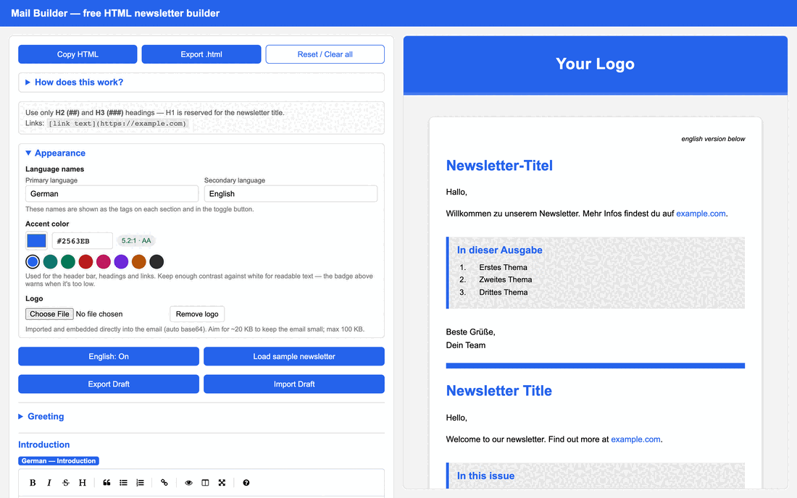

# Social preview

Image tooling for Mail Builder, adapted from
[maxstridde/social_preview](https://github.com/maxstridde/social_preview).

| Artifact | File | Used for |
| --- | --- | --- |
| Static OG card | [`og.png`](og.png) | GitHub repo social preview (Settings → General → Social preview) and `og:image` |
| Editor demo | [`assets/editor-demo.gif`](assets/editor-demo.gif) | README walkthrough |




> **Note:** GitHub's repo social-preview slot only accepts a static PNG/JPG, so
> upload `og.png` there. The GIF is for the README. The same image is copied to
> `../public/og-image.png`, which the deployed site serves as its `og:image`.

## Requirements

- **ImageMagick 7** (`magick`) — `brew install imagemagick`
- **Poppins** font (Title: ExtraBold, Subtitle/Button: SemiBold) in
  `~/Library/Fonts/`. Edit the `FONT_*` vars at the top of `og.sh` to point
  elsewhere. Get it from <https://fonts.google.com/specimen/Poppins>.
- For the GIF only: **Node** + **Playwright** (auto-detected from a global or
  `npx` install; nothing is added to the project's `package.json`).

## Generate the static OG image

```bash
./og.sh             # writes og.png
./og.sh out.png     # custom output path
cp og.png ../public/og-image.png   # update the deployed site's og:image too
```

The card shows a simple envelope mark drawn in the accent color (no external
logo asset). All text and colors live in the **config block** at the top of the
script.

## Generate the editor demo GIF

```bash
./build-editor-gif.sh   # writes assets/editor-demo.gif
```

This:

1. starts `npm run dev` if the app isn't already serving (defaults to
   `http://localhost:5173/mail-builder/`; override with `APP_URL=…`),
2. runs `capture-editor.mjs`, which drives the live builder with Playwright and
   writes four stage screenshots to `screenshots/` (initial → headline → intro
   Markdown → table of contents, each reflected in the live preview),
3. pads each frame and stitches them into the looping GIF.

`screenshots/` is regenerable and git-ignored. To re-shoot only the frames, run
`node capture-editor.mjs` with the dev server already up.

## What was adapted from the upstream repo

- `og.sh` ← `og-advanced.sh`: same framed-card + accent-shape + pill-button
  layout and ImageMagick pipeline, but it *draws an envelope mark* onto a card
  instead of cropping a photo, and uses the accent-blue palette + "Open the
  builder" CTA.
- `build-editor-gif.sh` ← `scripts/build-demo-gif.sh`: same "hold each frame,
  loop forever" stitching, but the frames are real captured UI stages.
